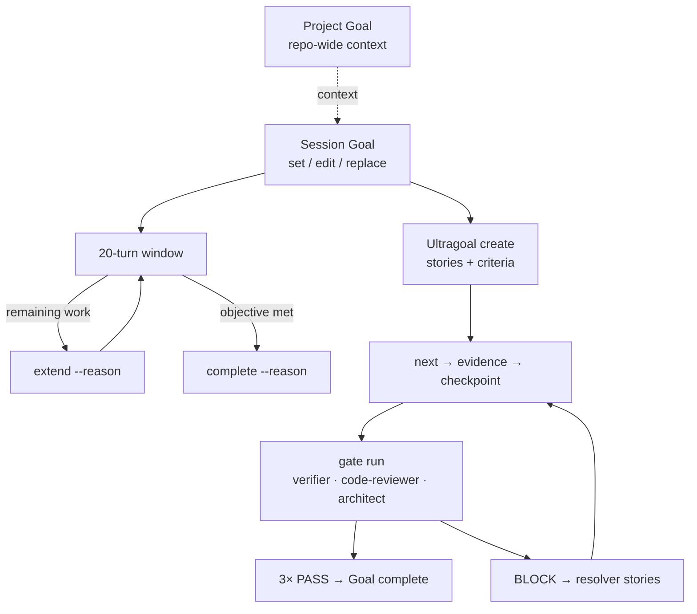

# Ultragoal

Ultragoal is a session-scoped sequential plan layered over `omp goal`.

Artifacts live under `.omp/ultragoal/<sha256-session-id>/`:

- `brief.md` snapshots the direct objective or Ralplan source.
- `manifest.json` stores revisioned stories, criteria, evidence, steering, and gate status.
- `ledger.jsonl` is the hash-linked mutation audit.
- `gates/` stores bounded role outputs and gate summaries.

## Lifecycle diagram



## Workflow

1. Create an active session Goal (`omp goal set … --session-id … --operation-id …`).
2. Create an Ultragoal plan from an objective or project-local Ralplan file.
3. Start and checkpoint one story at a time.
4. Attach file-hashed or note-hashed evidence to every criterion.
5. Run the restricted verifier, code-reviewer, and architect gate.
6. Resolve any non-PASS role through generated stories.
7. On three PASS results, the gate marks Ultragoal and its outer Goal complete.

All mutations require `--session-id` and a unique `--operation-id`. Evidence
files must be regular project files; outside paths, symlinks, and hardlinks are
rejected.

When the outer Session Goal is **replaced**, its `goalGeneration` changes.
Hook context (SessionStart and UserPromptSubmit) drops Ultragoal stories bound
to the previous generation. A later `omp ultragoal create` with the new
generation supersedes the old plan (fresh ledger + plan id); same-generation
recreate still fails with `ULTRAGOAL_EXISTS`.

Run `omp help` or `/ultragoal` for the command sequence.

## Local linked CLI smoke

From a built, `npm link`-ed checkout (see README **Local development**):

```bash
omp version --json          # packageRoot must be this checkout
omp goal --help             # help before session validation
omp ultragoal --help

SID="docs-smoke-$RANDOM"
OID="op-$RANDOM"
omp goal set "docs smoke" --session-id "$SID" --operation-id "$OID" --json
# Optional: create needs stories-json or a default single-story plan from the objective
# omp ultragoal create "docs smoke story" --session-id "$SID" --operation-id "${OID}-ug" --json
omp ultragoal status --session-id "$SID" --json
GENERATION="$(omp goal status --session-id "$SID" --json | jq -r .result.goalGeneration)"
omp goal complete --reason "docs smoke done" --session-id "$SID" --operation-id "${OID}-done" --expected-goal-generation "$GENERATION" --json
```

## Existing `/goal` installs

`omp setup` recognizes historical repository-goal skill hashes and migrates
them to the session Goal plus `/project-goal` without touching `.omp/goal.md`.
An unknown effective `/goal` is preserved, and legacy routing in instruction
sources is reported without modifying those sources; unrelated safe setup
files still install. `--force` does not overwrite an unknown `/goal`.
Successful user and project installs write a version-2 validation manifest
(`omp-bundle-manifest.json`) with bundle and catalog hashes.
